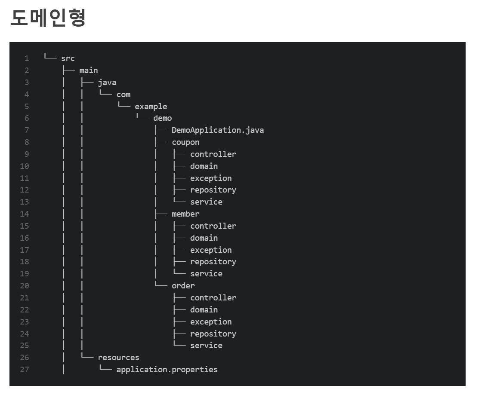

# 계층형 vs 도메인형

## 문제점
프로젝트 볼륨이 커지며 파일이 늘어날수록 내가 원하는 파일을 쉽게 찾을 수 없다는 단점을 느꼈고 이를 개선하고자 도메인형을 찾아보기 시작했다.

## 최근 기술 동향
최근 기술 동향
도메인 주도 개발, ORM, 객체지향 프로그래밍 등에서 도메인형 구조가 더 적합하다고 생각한다. 도메인 주도 개발에서 Root Aggregate 같은 표현은 계층형보다 도메인형으로 표현했을 경우 훨씬 더 직관적이며 해당 도메인을 이해하는 것에도 효율적이다.

## 계층형
각 계층을 대표하는 디렉터리를 기준으로 코드들이 구성한다.
Controller , Service , repository 폴더에 모든 모델의 파일이 한꺼번에 모여있음 
실제로 사용하면서도 수정을 할때 폴더를 일일이 열어서 수정해야하는 단점이 느껴졌음 

## 도메인형 
1개의 모델마다 폴더가 따로 생기고 폴더안에 모델의 해당하는 Controller , Service , repository 등의 파일이 모여있다
1개의 모델에 대해서 작업할때 수정이 편할 것 같다

